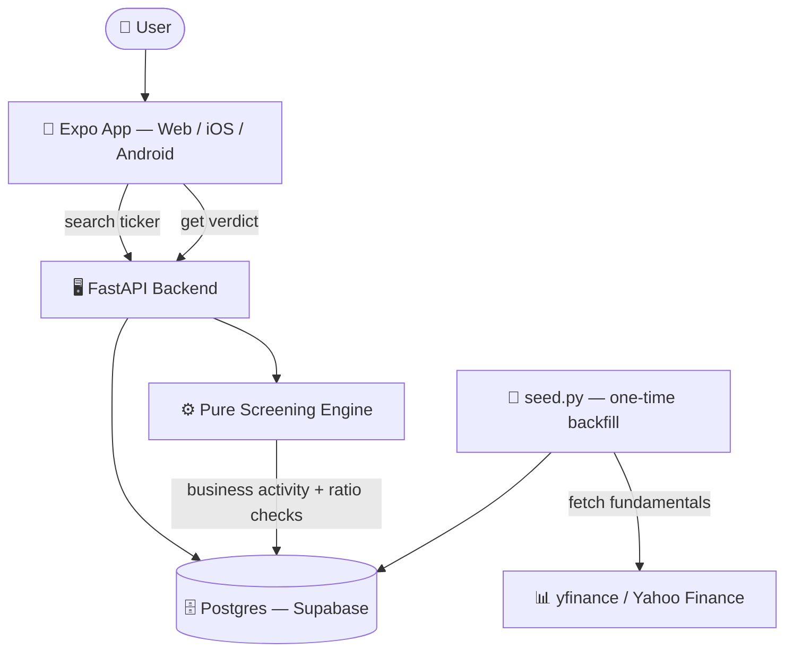

# 🕌 HalalScreen — European Halal Stock Screener

> Search a stock ticker, get an instant **Halal / Haram / Questionable** verdict based on an AAOIFI-inspired screening methodology — built for the European/Nordic retail investor gap left by US-centric tools like Zoya and Musaffa.

---

## 🎯 Overview

Islamic finance screening (AAOIFI standards) checks two things for a company:
1. **Business activity** — is the core business itself non-compliant (conventional banking, insurance, alcohol, tobacco, gambling, pork, weapons, adult entertainment)?
2. **Financial ratios** — is the company too indebted or holding too much interest-bearing cash relative to its market cap (both thresholds: **< 33%**)?

A full AAOIFI screen also computes a "% of revenue from impure sources" (the **Five Percent Rule**) — no free/cheap fundamentals API publishes that breakdown (it's licensed data, which is why Zoya/Musaffa are paid products). So V1 does the two screens that *are* computable from public fundamentals data, and returns **`questionable`** rather than guessing whenever sector/industry data is missing or ambiguous, instead of silently assuming a company is compliant.

| Verdict | Meaning |
|---|---|
| ✅ **Halal** | Compliant core business, both ratios pass |
| ❌ **Haram** | Non-compliant core business, or either ratio fails |
| ⚠️ **Questionable** | Sector/industry data missing or ambiguous — needs manual review |

**This is not financial advice** — every API response and every frontend screen carries that disclaimer.

---

## 🏗️ Architecture



The screening engine (`screening/engine.py`) is pure functions with zero DB/HTTP dependencies — it takes sector/industry/market-cap/debt/cash numbers in, returns a verdict out, and is exhaustively unit tested independent of the database or data provider.

---

## 🧰 Tech Stack

| Layer | Choice |
|---|---|
| **Backend** | Python 3.12, FastAPI, SQLModel |
| **Database** | Postgres (Supabase, hosted, free tier) — local SQLite fallback for dev |
| **Fundamentals data** | [`yfinance`](https://github.com/ranaroussi/yfinance) (unofficial Yahoo Finance wrapper) — see [Data source](#-data-source--why-yfinance) below |
| **Frontend** | Expo + Expo Router (React Native + Expo Web) — one codebase for web now, iOS/Android later |
| **Data fetching** | TanStack Query + axios |
| **Package management** | `uv` (backend), `npm` (frontend) |
| **Testing** | `pytest` (backend), `tsc --noEmit` (frontend) |
| **CI/CD** | GitHub Actions, Docker (backend) |

---

## 📂 Project Structure

```
halal-screener/
├── backend/
│   ├── src/halal_screener/
│   │   ├── app.py                    # FastAPI app, CORS, routers, /api/health
│   │   ├── config.py                 # Settings (env-driven)
│   │   ├── database.py               # SQLModel engine/session
│   │   ├── models.py                 # Company, FinancialRatios, ScreeningResult
│   │   ├── schemas.py                # API response DTOs
│   │   ├── screening/
│   │   │   ├── rules.py              # Non-compliant sector/industry list + ratio thresholds
│   │   │   └── engine.py             # Pure screening functions (no DB/HTTP)
│   │   ├── providers/
│   │   │   ├── base.py               # FundamentalsProvider interface
│   │   │   ├── yfinance_provider.py  # Active provider (free, no API key)
│   │   │   └── eodhd.py              # Alternate provider (needs a paid EODHD plan)
│   │   ├── api/routes/               # health, companies, screening
│   │   ├── services/                 # company_service, screening_service
│   │   └── scripts/seed.py           # One-time backfill of the seed ticker list
│   ├── migrations/0001_init.sql      # Raw SQL schema (no Alembic)
│   └── tests/
├── frontend/
│   ├── app/                          # Expo Router screens (index, stock/[ticker])
│   └── src/{api, components, hooks, config}/
├── docker-compose.yml
└── .github/workflows/ci.yml
```

---

## ⚡ Quickstart

### Prerequisites

- Python 3.12 + [`uv`](https://docs.astral.sh/uv/)
- Node.js + npm
- No API keys required — fundamentals come from `yfinance` (free, unofficial Yahoo Finance data)

### 1. Backend

```bash
cd backend
cp .env.example .env       # defaults to local SQLite, no edits needed to try it out
uv sync
```

Seed the database (one-time, hits live Yahoo Finance data for ~42 tickers, takes a few minutes):

```bash
uv run python -m halal_screener.scripts.seed
```

Start the API:

```bash
uv run uvicorn halal_screener.app:app --reload --port 8000
```

Confirm it's up: `curl http://127.0.0.1:8000/api/health`

### 2. Frontend

```bash
cd frontend
cp .env.example .env       # EXPO_PUBLIC_API_BASE_URL=http://localhost:8000
npm install
npm run web
```

Opens in your browser. Search a seeded company (e.g. "Novo", "Carlsberg", "AAPL"), tap a result, see the verdict, ratio breakdown, and broker CTAs.

There's no login/accounts in V1 — it's a stateless search → verdict flow.

---

## 🧪 Testing

```bash
cd backend
uv run pytest -v        # screening engine, provider mapping, API tests
uv run ruff check .      # lint
```

```bash
cd frontend
npx tsc --noEmit         # type-check
```

---

## 🐳 Docker

```bash
docker compose up
curl http://localhost:8000/api/health
```

`docker-compose.yml` runs the backend only — the database is hosted Supabase, not a local container. Set `SUPABASE_DB_URL` in your shell environment before running.

---

## 📊 Data source — why yfinance?

The original plan used [EODHD](https://eodhd.com/), but its **Fundamentals Data Feed** (sector, industry, balance sheet data — everything this app screens on) is a paid add-on ($59.99/mo), not part of the free plan. Rather than pay for a portfolio project, the fundamentals provider was swapped to `yfinance`, which is free but **unofficial** — it scrapes Yahoo Finance's undocumented endpoints and can break without notice if Yahoo changes their site.

The provider abstraction (`providers/base.py`) exists specifically so this can be swapped again later without touching the screening engine or API layer — `providers/eodhd.py` is kept, unused, in case a paid plan is worth it down the line.

**A known quirk:** ratio values look nonsensical for banks (e.g. debt ratio > 500%) because a bank's balance sheet (deposits, loans) isn't comparable to a normal company's. This is harmless in practice — banks are already excluded by the business-activity screen regardless of their ratios — but worth knowing if a number looks alarming.

---

## ⚠️ Known limitations (V1)

- No revenue-based "Five Percent Rule" — no free data source publishes a per-category revenue breakdown, so business-activity screening is a sector/industry exclusion list, not a computed percentage.
- No purification-percentage calculator (schema has nullable columns reserved for it).
- Search only covers the ~42 pre-seeded tickers — no live/arbitrary ticker lookup yet.
- Broker CTAs (`src/config/brokers.ts`) are placeholder links, not real affiliate tracking.

---

## 📜 License

Personal portfolio project.
